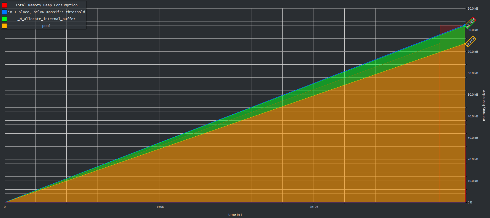

# tracing

## Examples

### Factorial

```cpp
#include "tracing.hpp"

static tracing::Tracer s_tracer{"factorial.json"};

static std::uint64_t factorial(std::uint64_t n) {
  if (n <= 1) {
    tracing::InstantEvent event{s_tracer, "factorial.case0"};
    return 1;
  }
  tracing::DurationEvent event{s_tracer, "factorial.case1"};
  return n * factorial(n - 1);
}

int main() {
  factorial(20);
  return 0;
}
```

<details>
  <summary>Perfetto</summary>
  
</details>

<details>
  <summary>Massif</summary>
  
</details>

### Fibonacci

```cpp
#include "tracing.hpp"

static tracing::Tracer s_tracer{"fibonacci.json"};

static std::uint64_t fibonacci(std::uint64_t n) {
  if (n <= 1) {
    tracing::InstantEvent event{s_tracer, "fibonacci.case0"};
    return n;
  }
  tracing::DurationEvent event{s_tracer, "fibonacci.case1"};
  return fibonacci(n - 1) + fibonacci(n - 2);
}

int main() {
  fibonacci(20);
  return 0;
}
```

<details>
  <summary>Perfetto</summary>
  
</details>

<details>
  <summary>Massif</summary>
  
</details>
