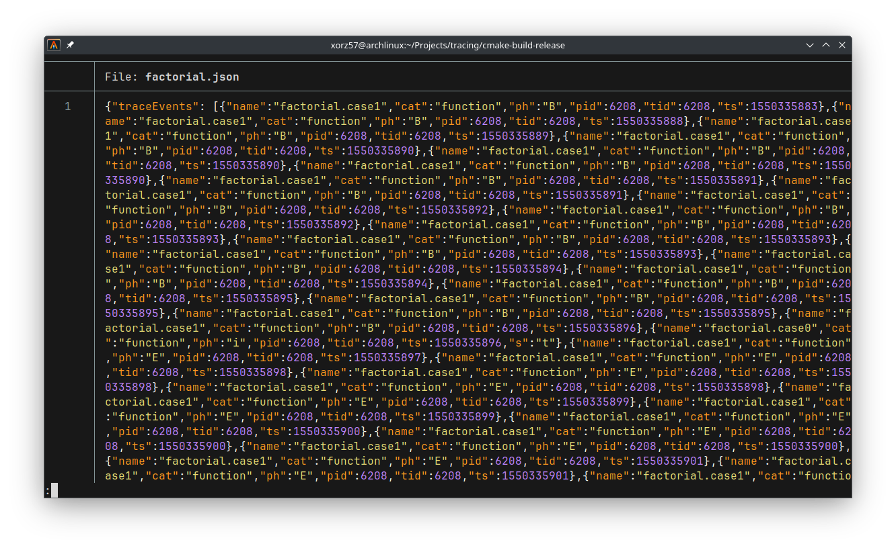
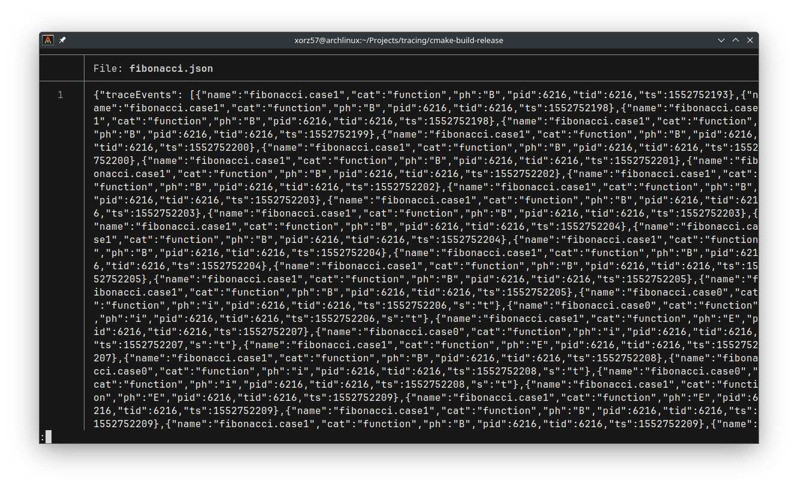
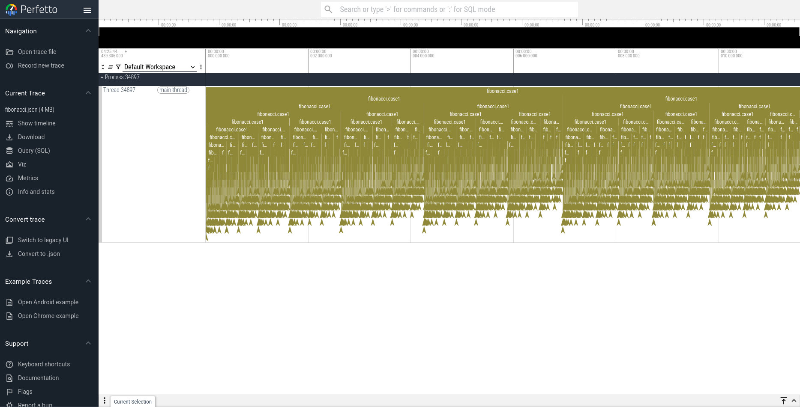

# tracing

[](https://github.com/xorz57/tracing/actions/workflows/cmake-multi-platform.yml)

A header-only C++ tracing library.

- Zero dependencies
- Compatible with Perfetto and Trace Event Profiling Tool

## Examples

```bash
cmake -B build -DCMAKE_BUILD_TYPE=Release -S .
cmake --build build --config Release
ctest --test-dir build --build-config Release --output-on-failure
```

### Factorial

```cpp
#include "tracing.hpp"

static tracing::Tracer s_tracer{"factorial.json"};

static std::uint64_t factorial(std::uint64_t n) {
  if (n <= 1) {
    const tracing::InstantEvent event{s_tracer, "factorial.case0"};
    return 1;
  }
  const tracing::DurationEvent event{s_tracer, "factorial.case1"};
  return n * factorial(n - 1);
}

int main() {
  factorial(20);
  return 0;
}
```

<details>
  <summary>Output</summary>
  
</details>

<details>
  <summary>Perfetto</summary>
  
</details>

<details>
  <summary>Massif</summary>
  
</details>

### Fibonacci

```cpp
#include "tracing.hpp"

static tracing::Tracer s_tracer{"fibonacci.json"};

static std::uint64_t fibonacci(std::uint64_t n) {
  if (n <= 1) {
    const tracing::InstantEvent event{s_tracer, "fibonacci.case0"};
    return n;
  }
  const tracing::DurationEvent event{s_tracer, "fibonacci.case1"};
  return fibonacci(n - 1) + fibonacci(n - 2);
}

int main() {
  fibonacci(20);
  return 0;
}
```

<details>
  <summary>Output</summary>
  
</details>

<details>
  <summary>Perfetto</summary>
  
</details>

<details>
  <summary>Massif</summary>
  
</details>
